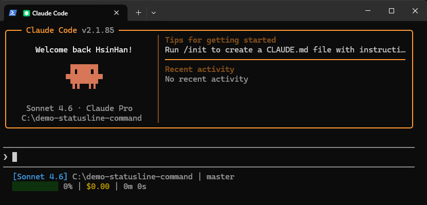
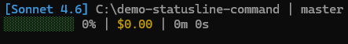

# Claude Code Status Line

A custom status line script for [Claude Code](https://claude.ai/code) that displays real-time session information in your terminal.

## Preview

### Preview 1 - Full Claude Code View



### Preview 2 - Status Line Close-up



## Features

**Line 1**
- Current model name (e.g., `[Sonnet 4.6]`)
- Clickable repository link (supports OSC 8 hyperlinks in iTerm2 / WezTerm / Kitty)
- Current git branch
- Git status: staged file count (green `+N`) and modified file count (yellow `~N`)

**Line 2**
- Context window usage bar (color changes green → yellow → red as usage increases)
- Context usage percentage
- Total session cost (USD)
- Session duration

## Requirements

- [Claude Code](https://claude.ai/code) v2.0+
- `bash`
- `git`
- [`jq`](https://jqlang.github.io/jq/) — JSON processor used to parse Claude Code's status input

## Installation

### 1. Download the script

Copy `statusline-command.sh` to your Claude config directory:

```bash
# The script must be placed at:
~/.claude/statusline-command.sh
```

### 2. Make it executable

```bash
chmod +x ~/.claude/statusline-command.sh
```

### 3. Configure Claude Code

Add the following to `~/.claude/settings.json`:

```json
{
  "statusLine": {
    "type": "command",
    "command": "~/.claude/statusline-command.sh"
  }
}
```

## How It Works

Claude Code calls this script on each status line update, passing a JSON payload via stdin. The script extracts:

| Field | JSON Path |
|---|---|
| Model name | `.model.display_name` |
| Working directory | `.workspace.current_dir` |
| Session cost | `.cost.total_cost_usd` |
| Context usage | `.context_window.used_percentage` |
| Duration | `.cost.total_duration_ms` |

The context bar uses 10 block characters (`█` filled, `░` empty) and changes color based on usage:

| Usage | Color |
|---|---|
| < 70% | Green |
| 70–89% | Yellow |
| ≥ 90% | Red |

## Terminal Compatibility

The clickable repository link uses [OSC 8 hyperlink escape sequences](https://gist.github.com/egmontkob/eb114294efbcd5adb1944c9f3cb5feda) and is supported in:

- iTerm2
- WezTerm
- Kitty
- Windows Terminal (partial)

In unsupported terminals, the repository name will still appear as plain text.

## Installing jq

### Windows (winget)
```bash
winget install jqlang.jq
```

### Windows (Scoop)
```bash
scoop install jq
```

### macOS (Homebrew)
```bash
brew install jq
```

### Linux (apt)
```bash
sudo apt install jq
```

### Manual (Windows)
1. Download `jq-windows-amd64.exe` from the [jq releases page](https://github.com/jqlang/jq/releases)
2. Rename it to `jq.exe`
3. Move it to a directory in your `PATH` (e.g., `C:\Windows\System32\`)

Verify installation:
```bash
jq --version
```